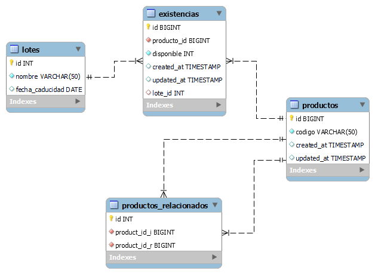

# Solucion problematica - surtido de productos 

## Caso:
Se desea poder surtir productos que el usuario requiera, basandose en el codigo y la cantidad que él mismo ingrese.
Tomando en cuenta el ID del producto ingresado, se hace una busqueda para iterar sobre los productos relacionados al mismo ID ingresado, con estos registros se surte la cantidad solicitada siempre dando prioridad de salida al proximo producto a caducar. En caso de que la cantidad solicitada sea mayor a la disponible en los productos relacionados se menciona la cantidad faltante a surtir.

## Librerias necesarias:
pip install mysql-connector-python
pip install prettytable

## Version de python utilizada:
3.11.1

Estructura de las tablas

